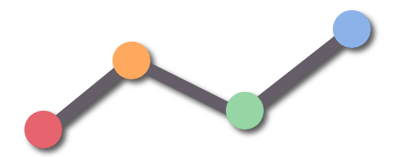

    

<h1 align="center">KStat</h1>

KStat is a small library for various statistical operations and probability distributions.

## Features

### Ranges

Ranges are used to represent certain values or results of operations. In particular, they are used to represent the 
result of a probability density function, cumulative distribution function, quantile function, etc. The following 
ranges are available:

- `Range(min: Double, max: Double)` - Represents a range of values from `min` (inclusive) to `max` (exclusive).
- `DisjointRange(vararg values: Double)` - Represents a disjoint range of values. 
- `SingularRange(value: Double)` - Represents a single value as a range.

### Probability Distributions

All distributions offer the following methods:

- `getSeed(): Int` - Returns the seed used for the random number generator
- `isDiscrete(): Boolean` - Returns whether the distribution is discrete or not
- `isContinuous(): Boolean` - Returns whether the distribution is continuous or not
- `sample(): Double` - Returns a random sample from the distribution
- `sample(n: Int): DoubleArray` - Returns an array of `n` random samples from the distribution
- `pdf(x: Double): IRange` - Returns the probability density function evaluated at `x`
- `cdf(x: Double): IRange` - Returns the cumulative distribution function evaluated at `x`
- `quantile(p: Double): IRange` - Returns the quantile function evaluated at `p`
- `mean(): Double` - Returns the mean of the distribution
- `variance(): Double` - Returns the variance of the distribution
- `stddev(): Double` - Returns the standard deviation of the distribution
- `skewness(): Double` - Returns the skewness of the distribution
- `kurtosis(): Double` - Returns the kurtosis of the distribution
- `entropy(): Double` - Returns the entropy of the distribution
- `median(): IRange` - Returns the median of the distribution
- `mode(): IRange` - Returns the mode of the distribution
- `mad(): Double` - Returns the mean absolute deviation of the distribution
- `moment(n: Int): Double` - Returns the `n`-th moment of the distribution
- `mgf(): (Int) -> Double` - Returns the moment generating function of the distribution

Discrete Distributions:

- Bernoulli - `Bernoulli(seed: Int, p: Double)`